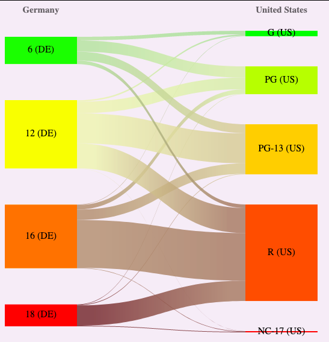

Movie Rating Comparisons
==========================

A movie rating (certification) comparison visualization between different countries, based on data from TMDB. 

Includes a script to pull the data down from TheMovieDB.org. 

Uses the Sankey diagram from https://github.com/Krzysiekzd/SanKEY.js to visualize the differences.

Usage
-----

You will need a key from [TheMovieDB.org](https://www.themoviedb.org/documentation/api)

 * Put the key in a file called `api_key.txt`. 
 * Run api_calls.php, preferrably from the command line so it can run for a longer time
   - This script can be interrupted. It will continue from the last data stored in the database. 
   - It will take a long time (several days, maybe) to download all the data. 
 * View index.php to see the results

Caveats
-------
